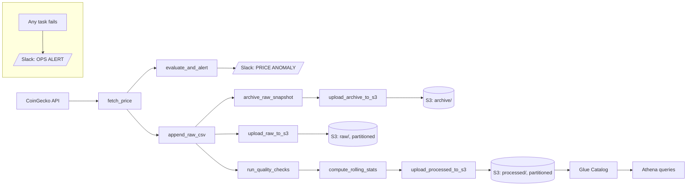

# Production-Grade Bitcoin Data Pipeline with Apache Airflow
### Near real-time API ingestion, anomaly detection, alerting, and AWS S3 archival orchestrated with Dockerized Apache Airflow
---

## Overview

This project implements a production-grade data pipeline that ingests near real-time Bitcoin price data from an external market API, computes rolling statistics for monitoring and anomaly detection, and persists both raw and processed outputs to cloud storage.

The pipeline is orchestrated using Apache Airflow and containerized with Docker to support reproducible execution, reliable scheduling, and operational visibility. To enable traceability and auditability, immutable raw data snapshots are archived alongside continuously appended logs.

Automated Slack alerts notify operators of significant short-term price movements, simulating real-world observability and incident response workflows. This project demonstrates the design and operation of a data pipeline that emphasizes API-based ingestion, workflow orchestration, cloud storage integration, and production-aware system design.

## Problem Statement

Building reliable data pipelines for external market data involves several operational and system-level challenges. Third-party APIs can be unstable, rate-limited, or change response formats over time, requiring controlled ingestion and error handling. Time-series financial data must be preserved in its raw form to enable traceability, auditing, and historical replay.

In addition, sudden price movements should be detected automatically and surfaced to operators through alerting mechanisms, rather than relying on manual inspection. Data pipelines must also be reproducible across environments and resilient to failures, with clear task boundaries and operational visibility.

This project addresses these challenges by designing a production-style pipeline that emphasizes reliable scheduling, immutable raw data archival, automated monitoring, and cloud-based persistence.

## Architecture



- **Orchestration:** Airflow (TaskFlow API, Airflow 3) schedules and runs ingestion, validation,
  archival, stats, and upload as separate tasks with their own retry policies.
- **Storage:** Raw/processed CSVs are kept locally for debugging; S3 uploads are Parquet, partitioned
  by `dt=YYYY-MM-DD/hour=HH/`, queryable via Athena over the Glue Catalog table Terraform manages.
- **Alerting:** two distinct Slack alert types - see [Observability](#observability) below.

## Objectives

- Ingest Bitcoin pricing data on an hourly schedule to simulate near real-time market ingestion from an external API.
- Persist continuously appended raw logs and immutable timestamped snapshots to support traceability and historical replay.
- Compute rolling mean and standard deviation metrics for monitoring and basic anomaly detection.
- Trigger automated Slack alerts when abnormal 1-hour or 24-hour price movements are detected.
- Upload raw and processed datasets to AWS S3 for durable cloud storage and downstream consumption.
- Execute the full pipeline end-to-end using a Dockerized Apache Airflow environment backed by a PostgreSQL metadata database.


## Pipeline Workflow (Airflow DAG: `bitcoin_data_pipeline`)

The pipeline is implemented as an Airflow DAG (TaskFlow API) with nine tasks, each with its own
retry policy, to support retries, monitoring, and modular extensibility.

| Task ID                   | Description                                                              |
| -------------------------- | ------------------------------------------------------------------------ |
| `fetch_price`               | Fetch price from CoinGecko (retried with backoff), validated via pydantic |
| `evaluate_and_alert`        | Detect 1h/24h anomalies beyond threshold, send `[PRICE ANOMALY]` Slack alert |
| `append_raw_csv`            | Append the fetched record to the raw CSV                                 |
| `archive_raw_snapshot`      | Copy the raw CSV to a timestamped snapshot file                          |
| `upload_archive_to_s3`      | Convert the snapshot to Parquet, upload to a partitioned `archive/` key  |
| `upload_raw_to_s3`          | Convert the raw CSV to Parquet, upload to a partitioned `raw/` key       |
| `run_quality_checks`        | Pandera schema + timestamp-gap validation; fails the run on bad data     |
| `compute_rolling_stats`     | Compute rolling mean/std over `price_usd`, save the processed CSV        |
| `upload_processed_to_s3`    | Convert processed CSV to Parquet, upload to a partitioned `processed/` key |

Any task failure triggers a distinct `[OPS ALERT]` Slack message via `on_failure_callback`.


## Data Outputs

The pipeline produces versioned artifacts locally (via Docker volume mounts) as CSV, and syncs
Parquet copies to AWS S3, partitioned by `dt=YYYY-MM-DD/hour=HH/` (when credentials are configured):

- **Raw append log:** `data/bitcoin_raw.csv` (local) → `s3://<bucket>/raw/dt=.../hour=.../bitcoin_raw.parquet`
- **Snapshot archive:** `data/archive/<timestamp>.csv` (local) → `s3://<bucket>/archive/dt=.../hour=.../<timestamp>.parquet`
- **Processed features:** `data/bitcoin_processed.csv` (local, rolling mean/std) → `s3://<bucket>/processed/dt=.../hour=.../bitcoin_processed.parquet`
- **Queryable via Athena** over the Glue Catalog table Terraform manages (see
  [Infrastructure as Code](#infrastructure-as-code-terraform)).

## Tech Stack

- **Orchestration:** Apache Airflow 3 (TaskFlow API)
- **Containerization:** Docker, Docker Compose
- **Data Source:** CoinGecko API
- **Storage:** Local CSV + Parquet on S3, queried via Athena/Glue Catalog
- **Data quality:** Pandera
- **Resilience:** pydantic (response validation), tenacity (retry/backoff)
- **Alerts:** Slack Webhooks
- **Secrets:** AWS Secrets Manager (Airflow SecretsManagerBackend)
- **Infrastructure as Code:** Terraform
- **CI/CD:** GitHub Actions
- **Language:** Python
- **Metadata DB:** PostgreSQL (Airflow backend)


##  Quickstart

### 1. Configure environment variables

```bash
cp .env.example .env
```

Fill in `.env` - at minimum, generate a Fernet key, an API secret key, and a JWT secret (a Python
`secrets.token_hex(24)` or similar works for the latter two), and set a Postgres password. Everything
else (Slack webhook, CoinGecko key, AWS credentials) can be left blank to start; the pipeline runs
fine without them, it just won't send alerts or upload to S3 yet. `.env` is gitignored - never commit it.

### 2. Start the Airflow environment

```bash
docker compose up --build
```

Wait for containers to initialize, especially `airflow-init` (runs DB migration and creates the
admin user) and `airflow-api-server`. This builds the image from the repo's `Dockerfile`, which
bakes in the `bitcoin_pipeline` package - after any code change, `docker compose up --build` again
to pick it up (it's not bind-mounted for live-reload).

### 3. Access Airflow UI

* Go to: [http://localhost:8080](http://localhost:8080)
* Login with the username from `AIRFLOW_ADMIN_USERNAME` in your `.env` (default `admin`) and its
  password. If you left `AIRFLOW_ADMIN_PASSWORD` blank, a random password was generated for you —
  find it with `docker compose logs airflow-init`. To rotate it later:

  ```bash
  docker compose exec airflow-api-server airflow users reset-password --username admin
  ```
* Trigger the DAG: `bitcoin_data_pipeline`

After execution:
- Raw and processed CSV files are written to the `data/` directory
- Snapshot files are archived under `data/archive/`
- Data is uploaded to AWS S3 if credentials are configured
- Slack alerts are sent if anomaly thresholds are met

##  File Structure

```plaintext
.
├── dags/
│   └── bitcoin_dag.py            # Airflow DAG (TaskFlow API): 9-task graph
├── bitcoin_pipeline/              # The package the DAG imports
│   ├── fetch.py                   # CoinGecko client + retry + pydantic validation
│   ├── alerts.py                  # Slack: price-anomaly + ops-failure alerts
│   ├── storage.py                 # CSV/Parquet I/O, S3 upload, archival
│   └── quality.py                 # Pandera schema + data-quality checks
├── tests/
│   ├── unit/                      # Mocked (responses/moto), no network/AWS
│   └── dags/                      # DAG integrity checks (needs Airflow installed)
├── infra/terraform/                # S3, IAM, Secrets Manager, Glue Catalog
├── .github/workflows/              # ci.yml, deploy.yml, terraform.yml
├── airflow.API.ipynb              # Demonstrates the API interaction logic
├── airflow.API.md                 # Markdown explanation of how the API works
├── airflow.example.ipynb          # Notebook running full pipeline sequence
├── airflow.example.md             # Explains pipeline implementation and design
├── data/                          # Volume mount for raw/processed/snapshot CSVs
├── Dockerfile                     # Builds the Airflow image w/ bitcoin_pipeline baked in
├── pyproject.toml                 # Package metadata, pinned deps, ruff/black/pytest config
├── requirements.txt               # Runtime deps installed into the Airflow image
├── docker-compose.yaml            # Brings up Airflow (4 services), Postgres, volumes
├── docker_bash.sh                 # Shell into the api-server container (needs WSL2/Git Bash on Windows)
└── .env.example                   # Template for your local .env (never commit .env)
````

##  Configuration

All configuration is via the `.env` file (see Quickstart step 1) - `docker-compose.yaml` reads it
automatically for every service via Compose's built-in `.env` substitution; there's nothing extra
to wire up. See `.env.example` for the full list with comments. A few worth calling out:

- `BITCOIN_RAW_PATH` / `BITCOIN_PROCESSED_PATH` / `BITCOIN_ARCHIVE_PATH` - override the in-container
  data file locations. Optional; sensible defaults are baked into `bitcoin_pipeline.storage`.
- `SLACK_WEBHOOK_URL` - enables both alert types (see Observability). Leave blank to disable alerting.
- `BITCOIN_PIPELINE_SKIP_S3` - skip S3 uploads entirely. Used by CI's smoke test; leave unset for normal use.


##  AWS S3 Access

Containers authenticate to AWS using environment variables set in your `.env` file
(`AWS_ACCESS_KEY_ID`, `AWS_SECRET_ACCESS_KEY`, `AWS_SESSION_TOKEN`, `AWS_DEFAULT_REGION`) — not a
mounted `~/.aws` directory. Use short-lived credentials where possible, and never commit `.env`.

Airflow is also configured with the
[`SecretsManagerBackend`](https://airflow.apache.org/docs/apache-airflow-providers-amazon/stable/secrets-backends/aws-secrets-manager.html)
so Connections/Variables can be resolved from AWS Secrets Manager under the `airflow/connections/*`
and `airflow/variables/*` prefixes (falling back to `.env`/the metastore if a key isn't found
there). To move the Slack webhook there once you have AWS access:

```bash
aws secretsmanager create-secret \
  --profile <your-profile> \
  --name airflow/variables/slack_webhook_url \
  --secret-string "<your-slack-webhook-url>"
```

##  Documentation

| File                                               | Description                                                                 |
|----------------------------------------------------|-----------------------------------------------------------------------------|
| [`bitcoin_pipeline/`](./bitcoin_pipeline)          | Package: fetch (CoinGecko + retries), alerts (Slack), storage (CSV/S3), quality (Pandera checks) |
| [`bitcoin_dag.py`](./dags/bitcoin_dag.py)          | Apache Airflow DAG that orchestrates the full ETL pipeline                 |
| [`airflow.API.ipynb`](./airflow.API.ipynb)         | Tool demonstration notebook — showcases how utility functions behave       |
| [`airflow.API.md`](./airflow.API.md)               | Explains each utility function's internal logic and expected behavior      |
| [`airflow.example.ipynb`](./airflow.example.ipynb) | Full project demo notebook — simulates the entire DAG workflow manually    |
| [`airflow.example.md`](./airflow.example.md)       | Describes the step-by-step pipeline execution and design rationale         |


## Observability

Two kinds of Slack alerts are sent, distinguishable by prefix:

- `[PRICE ANOMALY]` - a genuine 1h/24h price swing beyond the threshold. The data pipeline worked
  fine; the market moved.
- `[OPS ALERT]` - a task in the DAG itself failed (via `on_failure_callback`). Something broke and
  needs attention.

The CoinGecko fetch and the three S3 upload tasks (the network-dependent ones) get 3 retries with
exponential backoff and a 5-minute timeout; everything else uses the DAG default (2 retries, 10-minute
timeout).

StatsD metrics are supported but not enabled by default - see the commented-out
`AIRFLOW__METRICS__STATSD_*` block in `docker-compose.yaml` for how to wire up a `statsd-exporter`
service and, from there, a Grafana dashboard.

## CI/CD

`.github/workflows/ci.yml` runs on every push/PR: lint (ruff + black) → unit tests (`tests/unit` +
the DAG integrity check in `tests/dags`) → a docker build. `.github/workflows/deploy.yml` runs on
push to `main`: builds and pushes the image to GHCR, then brings the stack up in the runner and
triggers a real DAG run as a smoke test (with `BITCOIN_PIPELINE_SKIP_S3=true`, so it doesn't need
AWS credentials as a GitHub secret).

To enable `deploy.yml`'s smoke test, add these repo secrets (Settings → Secrets and variables →
Actions) - throwaway values used only to bring the stack up in CI, not your real deployment's
secrets:

- `SMOKE_TEST_POSTGRES_PASSWORD`
- `SMOKE_TEST_FERNET_KEY`
- `SMOKE_TEST_API_SECRET_KEY`
- `SMOKE_TEST_JWT_SECRET`
- `SMOKE_TEST_ADMIN_PASSWORD`

Until those are added, `deploy.yml` will fail at the "Write .env" step with empty values - `ci.yml`
does not need any secrets and works as soon as it's pushed.

## Infrastructure as Code (Terraform)

`infra/terraform/` defines the AWS resources the pipeline needs: the S3 bucket (versioned,
encrypted, lifecycle rules), a least-privilege IAM policy, the two Secrets Manager entries, and a
Glue Catalog table over the partitioned `processed/` data for Athena. **`terraform apply` is never
run automatically** - `.github/workflows/terraform.yml` only runs `fmt`/`validate`/`plan` on PRs
touching `infra/terraform/**` (commenting the plan on the PR); an actual `apply` requires a manual
`workflow_dispatch` gated by a GitHub Environment called `production` with required reviewers,
which you set up once in Settings → Environments.

**One-time state-backend bootstrap** (run these yourself with your AWS profile - Terraform can't
manage the bucket it stores its own state in):

```bash
aws s3api create-bucket --bucket <your-unique-tfstate-bucket> --region us-east-1 --profile bitcoin-pipeline
aws s3api put-bucket-versioning --bucket <your-unique-tfstate-bucket> --versioning-configuration Status=Enabled --profile bitcoin-pipeline
aws s3api put-public-access-block --bucket <your-unique-tfstate-bucket> --public-access-block-configuration BlockPublicAcls=true,IgnorePublicAcls=true,BlockPublicPolicy=true,RestrictPublicBuckets=true --profile bitcoin-pipeline
aws dynamodb create-table --table-name terraform-locks --attribute-definitions AttributeName=LockID,AttributeType=S --key-schema AttributeName=LockID,KeyType=HASH --billing-mode PAY_PER_REQUEST --profile bitcoin-pipeline
```

Then locally:

```bash
cd infra/terraform
cp backend.hcl.example backend.hcl        # fill in your bootstrapped bucket name
cp terraform.tfvars.example terraform.tfvars   # fill in a globally-unique s3_bucket_name
terraform init -backend-config=backend.hcl
terraform plan     # review carefully before ever applying
```

Since Phase 3's secrets were created by hand via the AWS CLI (before Terraform existed), import
them into state instead of letting Terraform try to recreate them:

```bash
terraform import aws_secretsmanager_secret.slack_webhook airflow/variables/slack_webhook_url
terraform import aws_secretsmanager_secret.coingecko_api_key airflow/variables/coingecko_api_key
```

After applying (manually, or via the approved `workflow_dispatch` apply job), Athena won't see any
partitions yet - the Glue table's partition metadata is only populated by a crawler or an explicit
`MSCK REPAIR TABLE bitcoin_processed` / `ALTER TABLE ... ADD PARTITION` once data actually exists
under `processed/dt=.../hour=.../`.

For CI's `fmt-validate-plan`/`apply` jobs, add these repo secrets too (use a CI-scoped IAM
credential, not your personal profile): `TF_AWS_ACCESS_KEY_ID`, `TF_AWS_SECRET_ACCESS_KEY`,
`TF_STATE_BUCKET`, `TF_STATE_REGION`, `TF_STATE_LOCK_TABLE`, `TF_S3_BUCKET_NAME`.

## Limitations & Next Steps

**Limitations**
- Runs on an hourly schedule (near real-time), not true streaming.
- Uses CSV-based artifacts rather than database or warehouse tables.
- Anomaly detection is based on rolling statistics and threshold rules.

**Next Steps**
- Persist processed outputs to a database or warehouse for analytics use, beyond Athena-over-S3.
- Wire up the StatsD → Grafana dashboard described in Observability above.
- Managed deployment (MWAA/Composer/Astronomer) for a live demo, instead of running locally - out
  of scope for this pass; costs real money to keep running.

##  References

* [CoinGecko API Docs](https://www.coingecko.com/en/api)
* [Apache Airflow TaskFlow](https://airflow.apache.org/docs/apache-airflow/stable/tutorial/taskflow.html)
* [AWS S3 Python SDK](https://boto3.amazonaws.com/v1/documentation/api/latest/index.html)
* [Slack Webhooks](https://api.slack.com/messaging/webhooks)


