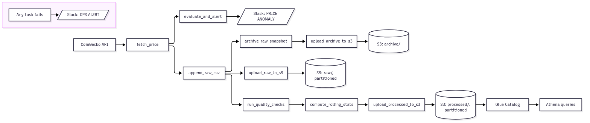

# Bitcoin Price Data Pipeline

Hourly Bitcoin price ingestion, anomaly detection, and a partitioned S3/Athena data lake — orchestrated with Apache Airflow 3, containerized with Docker, and provisioned with Terraform.

[](https://github.com/Dharmitha7/Real-Time-Bitcoin-Data-Processing-With-Airflow/actions/workflows/ci.yml)


## What this is

Every hour, this pipeline pulls the current Bitcoin price from the CoinGecko API, checks it for
abnormal 1h/24h swings, validates and archives the raw data, computes rolling statistics, and
uploads everything to S3 as partitioned Parquet — queryable through Athena via a Glue Catalog
table. A task failure and a genuine price anomaly produce two distinctly-labeled Slack alerts, so
"the market moved" is never confused with "the pipeline broke."

It's a scheduled batch job, not a streaming system — CoinGecko's free tier and an hourly cadence
are enough to demonstrate real orchestration, data-quality, and observability patterns without
needing a message broker or a paid market-data feed.

## Architecture



- **Orchestration:** Airflow 3 (TaskFlow API) runs ingestion, validation, archival, stats, and
  upload as separate tasks, each with its own retry policy.
- **Storage:** raw/processed CSVs are kept locally for debugging; S3 uploads are Parquet,
  partitioned by `dt=YYYY-MM-DD/hour=HH/`, queryable via Athena over a Terraform-managed Glue
  Catalog table.
- **Alerting:** two distinct Slack alert types — see [Observability](#observability).
- **Secrets:** AWS Secrets Manager via Airflow's `SecretsManagerBackend`; nothing sensitive is
  bind-mounted or committed.
- **Infrastructure:** the S3 bucket, IAM policy, and Glue Catalog are defined in Terraform, never
  applied automatically.

## Quickstart

```bash
git clone https://github.com/Dharmitha7/Real-Time-Bitcoin-Data-Processing-With-Airflow.git
cd Real-Time-Bitcoin-Data-Processing-With-Airflow
cp .env.example .env
```

Fill in `.env` — at minimum, a Postgres password and a Fernet key, API secret key, and JWT secret
(`python -c "import secrets; print(secrets.token_hex(24))"` works for the latter two, or
`python -c "from cryptography.fernet import Fernet; print(Fernet.generate_key().decode())"` for the
Fernet key). Everything else (Slack webhook, CoinGecko key, AWS credentials) can stay blank to
start — the pipeline runs fine without them, it just won't alert or upload to S3 yet. `.env` is
gitignored; never commit it.

```bash
docker compose up --build
```

This builds the Airflow image (bakes in the `bitcoin_pipeline` package — re-run with `--build`
after any code change, since it isn't bind-mounted for live-reload) and starts Postgres plus four
Airflow services. Once `airflow-api-server` is healthy:

1. Open [http://localhost:8080](http://localhost:8080)
2. Log in with `AIRFLOW_ADMIN_USERNAME` from `.env` (default `admin`) and its password — if you
   left `AIRFLOW_ADMIN_PASSWORD` blank, a random one was generated; find it with
   `docker compose logs airflow-init`. Rotate it anytime with:
   ```bash
   docker compose exec airflow-api-server airflow users reset-password --username admin
   ```
3. Trigger the `bitcoin_data_pipeline` DAG

After a run: raw/processed CSVs land in `data/`, snapshots in `data/archive/`, S3 gets Parquet
uploads if AWS credentials are configured, and Slack gets an alert if an anomaly threshold is hit.

## Pipeline workflow

Nine TaskFlow tasks, each with its own retry policy:

| Task ID | Description |
| --- | --- |
| `fetch_price` | Fetch price from CoinGecko (retried with backoff), validated via pydantic |
| `evaluate_and_alert` | Detect 1h/24h anomalies beyond threshold, send `[PRICE ANOMALY]` Slack alert |
| `append_raw_csv` | Append the fetched record to the raw CSV |
| `archive_raw_snapshot` | Copy the raw CSV to a timestamped snapshot file |
| `upload_archive_to_s3` | Convert the snapshot to Parquet, upload to a partitioned `archive/` key |
| `upload_raw_to_s3` | Convert the raw CSV to Parquet, upload to a partitioned `raw/` key |
| `run_quality_checks` | Pandera schema + timestamp-gap validation; fails the run on bad data |
| `compute_rolling_stats` | Compute rolling mean/std over `price_usd`, save the processed CSV |
| `upload_processed_to_s3` | Convert processed CSV to Parquet, upload to a partitioned `processed/` key |

Any task failure triggers a distinct `[OPS ALERT]` Slack message via `on_failure_callback`.

## Data outputs

Local artifacts are CSV (via Docker volume mounts); S3 gets Parquet, partitioned by
`dt=YYYY-MM-DD/hour=HH/`:

| Local | S3 |
| --- | --- |
| `data/bitcoin_raw.csv` | `s3://<bucket>/raw/dt=.../hour=.../bitcoin_raw.parquet` |
| `data/archive/<timestamp>.csv` | `s3://<bucket>/archive/dt=.../hour=.../<timestamp>.parquet` |
| `data/bitcoin_processed.csv` (rolling mean/std) | `s3://<bucket>/processed/dt=.../hour=.../bitcoin_processed.parquet` |

Queryable via Athena over the Glue Catalog table Terraform manages (see
[Infrastructure as Code](#infrastructure-as-code-terraform)).

## Configuration

All configuration is via `.env` — `docker-compose.yaml` reads it automatically for every service
via Compose's built-in substitution; there's nothing extra to wire up. See `.env.example` for the
full list with comments. Worth calling out:

- `BITCOIN_RAW_PATH` / `BITCOIN_PROCESSED_PATH` / `BITCOIN_ARCHIVE_PATH` — override the
  in-container data file locations. Optional; defaults are baked into `bitcoin_pipeline.storage`.
- `SLACK_WEBHOOK_URL` — enables both alert types. Leave blank to disable alerting.
- `BITCOIN_PIPELINE_SKIP_S3` — skip S3 uploads entirely. Used by CI's smoke test; leave unset
  otherwise.

## AWS access and secrets

Containers authenticate to AWS via environment variables in `.env` (`AWS_ACCESS_KEY_ID`,
`AWS_SECRET_ACCESS_KEY`, `AWS_SESSION_TOKEN`, `AWS_DEFAULT_REGION`) — not a mounted `~/.aws`
directory. Prefer short-lived credentials, and never commit `.env`.

Airflow is also configured with the
[`SecretsManagerBackend`](https://airflow.apache.org/docs/apache-airflow-providers-amazon/stable/secrets-backends/aws-secrets-manager.html),
so Connections/Variables resolve from AWS Secrets Manager under `airflow/connections/*` and
`airflow/variables/*` (falling back to `.env`/the metastore if a key isn't found there). To move
the Slack webhook there once you have AWS access:

```bash
aws secretsmanager create-secret \
  --profile <your-profile> \
  --name airflow/variables/slack_webhook_url \
  --secret-string "<your-slack-webhook-url>"
```

## Observability

Two kinds of Slack alerts, distinguishable by prefix:

- `[PRICE ANOMALY]` — a genuine 1h/24h price swing beyond the threshold. The pipeline worked fine;
  the market moved.
- `[OPS ALERT]` — a task in the DAG itself failed. Something broke and needs attention; the
  message includes the failure reason.

The CoinGecko fetch and the three S3 upload tasks get 3 retries with exponential backoff and a
5-minute timeout; everything else uses the DAG default (2 retries, 10-minute timeout).

StatsD metrics are supported but not enabled by default — see the commented-out
`AIRFLOW__METRICS__STATSD_*` block in `docker-compose.yaml` for wiring up a `statsd-exporter` and,
from there, a Grafana dashboard.

## CI/CD

`.github/workflows/ci.yml` runs on every push/PR: lint (ruff + black) → unit tests (`tests/unit` +
the DAG integrity check in `tests/dags`) → a Docker build. `.github/workflows/deploy.yml` runs on
push to `main`: builds and pushes the image to GHCR, then brings the stack up in the runner and
triggers a real DAG run as a smoke test (`BITCOIN_PIPELINE_SKIP_S3=true`, so no AWS credentials are
needed for it).

To enable `deploy.yml`'s smoke test, add these repo secrets (Settings → Secrets and variables →
Actions) — throwaway values used only to bring the stack up in CI, not real deployment secrets:
`SMOKE_TEST_POSTGRES_PASSWORD`, `SMOKE_TEST_FERNET_KEY`, `SMOKE_TEST_API_SECRET_KEY`,
`SMOKE_TEST_JWT_SECRET`, `SMOKE_TEST_ADMIN_PASSWORD`. `ci.yml` needs no secrets and works as soon
as it's pushed.

## Infrastructure as Code (Terraform)

`infra/terraform/` defines the AWS resources the pipeline needs: an S3 bucket (versioned,
encrypted, lifecycle rules), a least-privilege IAM policy, the two Secrets Manager entries, and a
Glue Catalog table over the partitioned `processed/` data. **`terraform apply` is never run
automatically** — `.github/workflows/terraform.yml` only runs `fmt`/`validate`/`plan` on PRs
touching `infra/terraform/**`; an actual `apply` requires a manual `workflow_dispatch` gated by a
GitHub Environment with required reviewers.

One-time state-backend bootstrap (Terraform can't manage the bucket it stores its own state in):

```bash
aws s3api create-bucket --bucket <your-unique-tfstate-bucket> --region us-east-1 --profile <profile>
aws s3api put-bucket-versioning --bucket <your-unique-tfstate-bucket> --versioning-configuration Status=Enabled --profile <profile>
aws s3api put-public-access-block --bucket <your-unique-tfstate-bucket> --public-access-block-configuration BlockPublicAcls=true,IgnorePublicAcls=true,BlockPublicPolicy=true,RestrictPublicBuckets=true --profile <profile>
aws dynamodb create-table --table-name terraform-locks --attribute-definitions AttributeName=LockID,AttributeType=S --key-schema AttributeName=LockID,KeyType=HASH --billing-mode PAY_PER_REQUEST --profile <profile>
```

Then:

```bash
cd infra/terraform
cp backend.hcl.example backend.hcl              # fill in your bootstrapped bucket name
cp terraform.tfvars.example terraform.tfvars    # fill in a globally-unique s3_bucket_name
terraform init -backend-config=backend.hcl
terraform plan     # review before ever applying
```

The two secrets were created by hand via the AWS CLI, so import them instead of letting Terraform
recreate them:

```bash
terraform import aws_secretsmanager_secret.slack_webhook airflow/variables/slack_webhook_url
terraform import aws_secretsmanager_secret.coingecko_api_key airflow/variables/coingecko_api_key
```

After applying, Athena won't see partitions yet — the Glue table's partition metadata needs a
crawler or an explicit `MSCK REPAIR TABLE bitcoin_processed` once data exists under
`processed/dt=.../hour=.../`.

CI's `fmt-validate-plan`/`apply` jobs need their own repo secrets (a CI-scoped IAM credential, not
your personal profile): `TF_AWS_ACCESS_KEY_ID`, `TF_AWS_SECRET_ACCESS_KEY`, `TF_STATE_BUCKET`,
`TF_STATE_REGION`, `TF_STATE_LOCK_TABLE`, `TF_S3_BUCKET_NAME`.

## Tech stack

Apache Airflow 3 (TaskFlow API) · Docker / Docker Compose · CoinGecko API · Pandas / PyArrow ·
Pandera · pydantic · tenacity · AWS S3, Secrets Manager, Glue/Athena · Terraform · GitHub Actions ·
PostgreSQL · Slack webhooks

## File structure

```plaintext
.
├── dags/bitcoin_dag.py        # Airflow DAG (TaskFlow API): the 9-task graph above
├── bitcoin_pipeline/           # Package the DAG imports
│   ├── fetch.py                 # CoinGecko client, retry, pydantic validation
│   ├── alerts.py                # Slack: price-anomaly + ops-failure alerts
│   ├── storage.py               # CSV/Parquet I/O, S3 upload, archival
│   └── quality.py               # Pandera schema + data-quality checks
├── tests/
│   ├── unit/                    # Mocked (responses/moto), no network or AWS
│   └── dags/                    # DAG integrity checks (needs Airflow installed)
├── infra/terraform/             # S3, IAM, Secrets Manager, Glue Catalog
├── .github/workflows/           # ci.yml, deploy.yml, terraform.yml
├── docs/architecture.mmd        # Mermaid source for the diagram above
├── Dockerfile                   # Builds the Airflow image from pyproject.toml
├── pyproject.toml               # Package metadata, pinned deps, ruff/black/pytest config
├── docker-compose.yaml          # Airflow (4 services) + Postgres
└── .env.example                 # Template for your local .env
```

## Limitations & next steps

**Limitations**
- Hourly polling, not a streaming system.
- CSV/Parquet artifacts rather than a database or warehouse table.
- Anomaly detection is threshold-based on rolling statistics, not a learned model.

**Next steps**
- Persist processed outputs to a database or warehouse, beyond Athena-over-S3.
- Wire up the StatsD → Grafana dashboard described in Observability.
- A managed deployment (MWAA/Composer/Astronomer) for an always-on demo is deliberately out of
  scope — it costs real money to keep running.

## References

- [CoinGecko API docs](https://www.coingecko.com/en/api)
- [Apache Airflow TaskFlow](https://airflow.apache.org/docs/apache-airflow/stable/tutorial/taskflow.html)
- [boto3 (AWS SDK for Python)](https://boto3.amazonaws.com/v1/documentation/api/latest/index.html)
- [Slack incoming webhooks](https://api.slack.com/messaging/webhooks)
